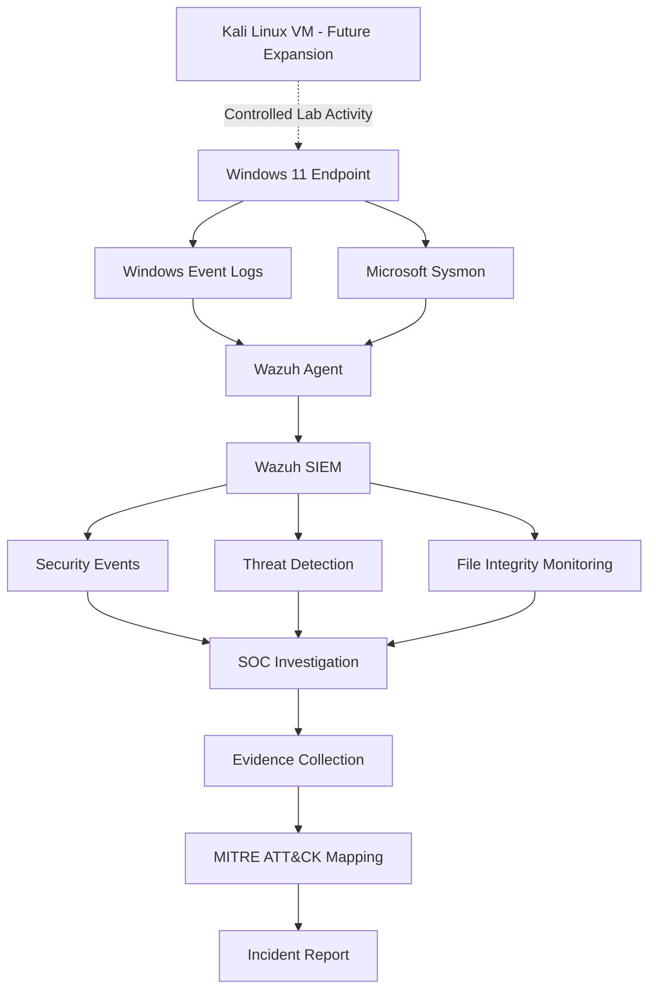

# HomeSOC Lab Architecture

## Overview

The HomeSOC environment is designed to collect and analyze Windows
security telemetry using Wazuh and Microsoft Sysmon.

The lab initially focuses on endpoint monitoring and will later be
expanded with an isolated Kali Linux system for controlled security
testing.

## Architecture

## Data Flow

The primary monitoring workflow is:

Windows Endpoint  
→ Windows Event Logs / Sysmon  
→ Wazuh Agent  
→ Wazuh SIEM  
→ Security Alert  
→ Investigation  
→ Incident Documentation

## Planned Components

| Component | Purpose |
|---|---|
| Windows 11 | Monitored endpoint |
| Wazuh Agent | Security telemetry collection |
| Sysmon | Advanced Windows event logging |
| Wazuh SIEM | Log analysis and threat detection |
| Windows Event Viewer | Local event investigation |
| MITRE ATT&CK | Threat technique mapping |
| Kali Linux | Future controlled security testing environment |
